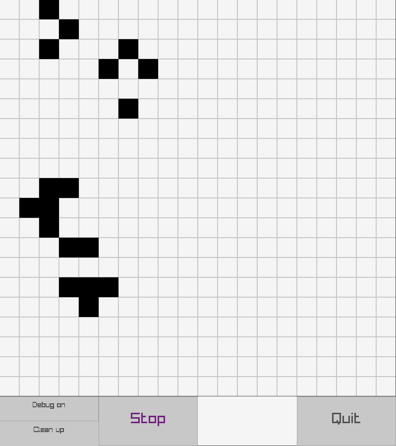

# LifeGameRay

The Conway's Game of Life made with Raylib.

Grid and cell are defined in the [grid.py file](grid.py).

## Install

`pip install -r requirements.txt`

## Run

`python3 app.py`

You should have something like this :

## How to use

- _Debug on_ / _Debug off_ to switch debug mode

- _Run_ / _Stop_ to run/pause the game

- You can choose the game speed with the _-_ and _+_ buttons

- _S_, _M_, _L_, _XL_ to change the map size

- _Clean up_ to clear the screen

- _Quit_ to quit

:warn: You can click the grid only when the game is paused.

Have fun !