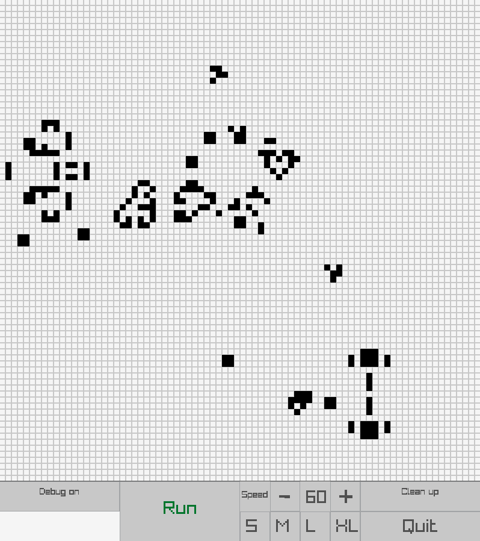

# LifeGameRay

The Conway's Game of Life made with Raylib.

## Install

`pip install -r requirements.txt`

## Run

`python3 app.py`

You should have something like this :

Press button _Debug on_ / _Debug off_ to switch debug mode, _Clean up_ to clear the screen, _Run_ / _Stop_ to run/pause the game and _Quit_ to quit.

You can click the grid only when the game is paused.

Have fun !